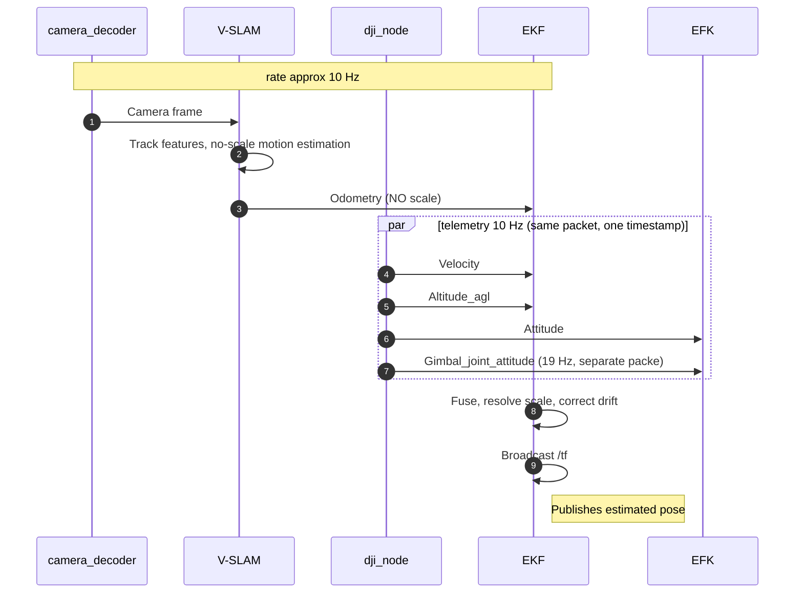
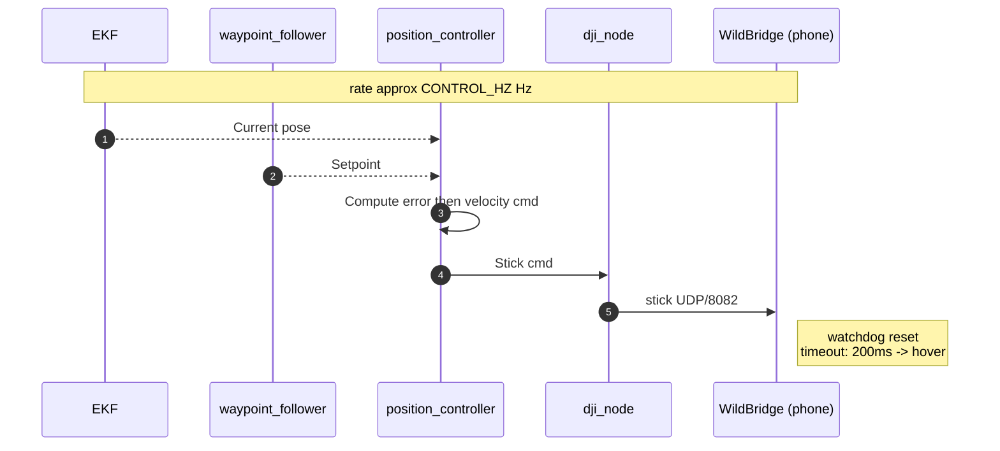
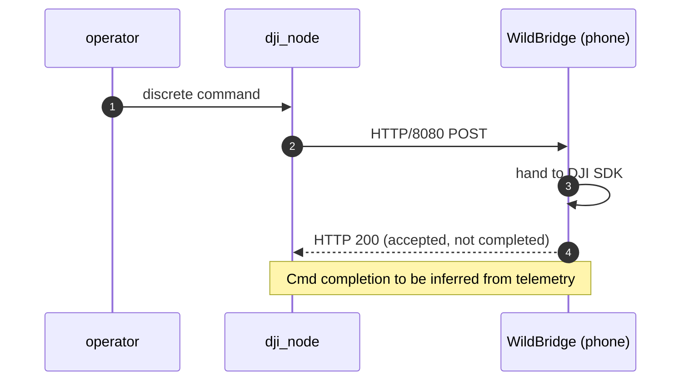
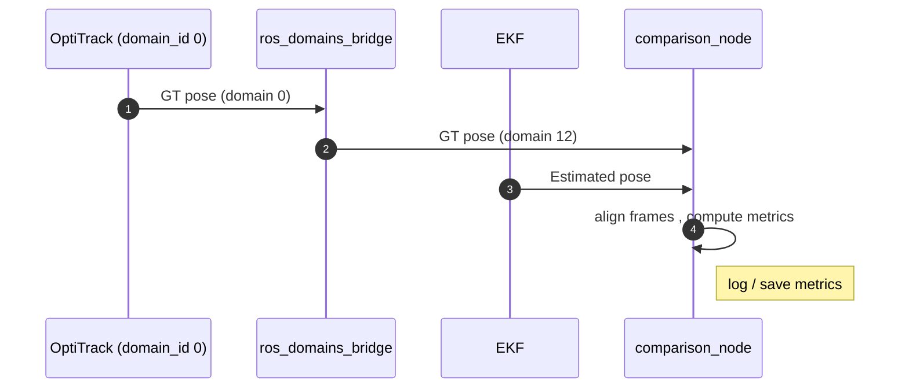

# Data Flow / Sequence

Traces frames, pose, velocity and commands through the nodes over time.

---

## Localisation — runs at camera rate

**Timing note:** telemetry carries measurement-time stamps (phone key listener + clock-offset mapping), so its latency is resolved. Camera frames are stamped at decode time minus VIDEO_LATENCY, still to be measured. Fuse in timestamp order.

---

## 6b. Control loop - ~high rate

**Timing note:** pose age at the controller is ~310 ms (video ~200 + SLAM ~40 + gimbal tf ≤53 + filter ~10). This is not compared against the watchdog — the watchdog checks command freshness, not pose age. position_controller runs on a fixed timer and publishes regardless of pose arrival, so the watchdog is satisfied by construction. The 310 ms instead caps position-loop bandwidth at ~0.15 Hz, which is why waypoint_follower needs a conservative max_velocity.

---

## 6c. Discrete commands (takeoff / land) — event-driven, reliable

---

## 6d. Evaluation flow (dev-only) — low rate

---

## Notes
- 6b + 6c share the same drone command path, hoever 6b is continuous/loss-tolerant (UDP) and 6c is discrete/reliable (HTTP + ACK).
