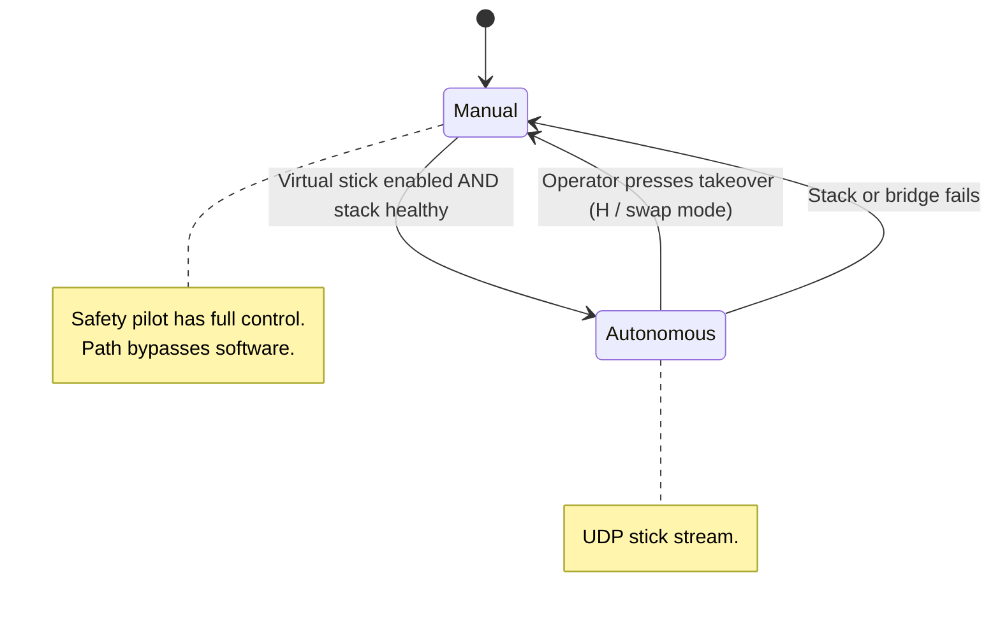
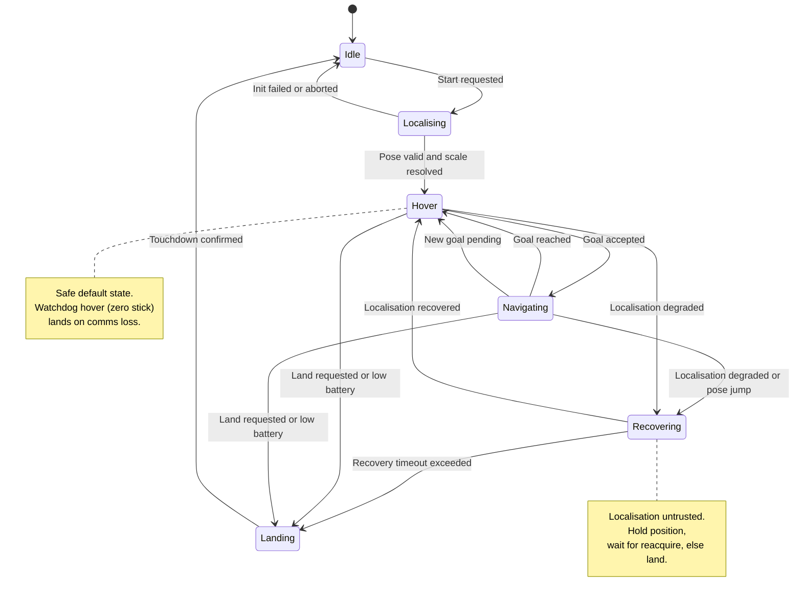

# System State Machine (flight modes + safety)

Behavioural changes and the transitions
between them. Also, it inlcudes the system safety logic.

---

## 7a. Command authority (manual vs autonomous)

The RC arbitrates in hardware — manual override always wins. This machine records that authority, not the drone firmware's internal logic.

---

## 7b. Autonomous flight behaviour

Hover is the safe default that every failure drains into.

## Thresholds and conditions to define
- Stack healthy: all flight-critical nodes up and pose valid.
- localisation "degraded": covariance above COV_MAX, or VO tracking lost, or
  pose jump above JUMP_MAX between updates.
- recovery timeout: 10 s before forcing Landing.
- low battery: 15 %.

## Cross-references
- Watchdog hover (200 ms comms loss) enters Hover in 7b and, on the phone side, is what the dead-man switch enforces regardless of stack state.